#### **CSCI 1300 CS1: Starting Computing: Homework 0**
#### **Naidu/Yeh/Hoefer - Fall 2022**
#### **Due: Friday, August 26 by 5:00pm MST**

Zip file submission must be completed and submitted by Friday, August 26 by 5pm to recieve credit. 


# Table of contents

1. [Objectives](#objectives)
2. [Submission Instructions](#submit)
3. [Grading rubric](#grading)


# Objectives <a name="objectives"></a>

1. [Set up VSCode](#setup)
2. [Learn essential Linux commands](#linux)
3. [Write your first C++ program](#firstprogram)


## 1. Setup VSCode <a name="setup"></a>
In recitation today, you will be getting started with Visual Studio Code (VS Code), a local development environment we’ll use throughout the semester. Follow the steps below. If you need help, ask your TA or one of the LAs (You can post on **Edstem** as well, our class discussion forum).

You can find the links to the VSCode Setup Guide on Canvas under the assignment “Homework 0”. Choose the guide corresponding to your operating system. Windows users will also need to install Windows Subsystem for Linux (WSL).


## 2. Learn how to use Terminal <a name="linux"></a>
In Visual Studio Code, you can open an integrated terminal, which initially starts at the root of your workspace. But what is a terminal?

A **terminal** is an **interface** to your computer which allows you to **execute any task on the computer** directly through **commands, without the use of a graphical user interface or GUI** (like the file explorers on your system that you use to navigate to folders, create files etc). This allows you to directly execute tasks, which is often quicker than using the GUI.

1. First, open VSCode.

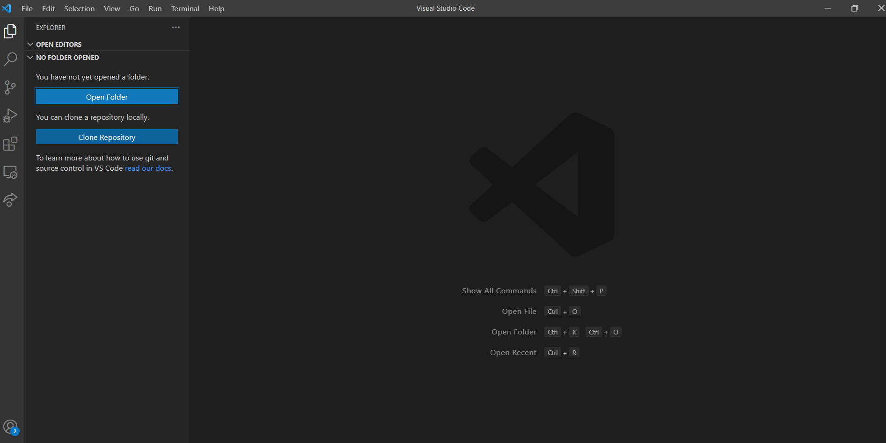

2. In VSCode, click on Open Folder and select the folder you wish to have your program file in if not open yet. 

In this case, the folder name selected is CSCI1300, but it may look different for you. You might browse through your system a bit to find the folder, otherwise create a new folder wherever you like.

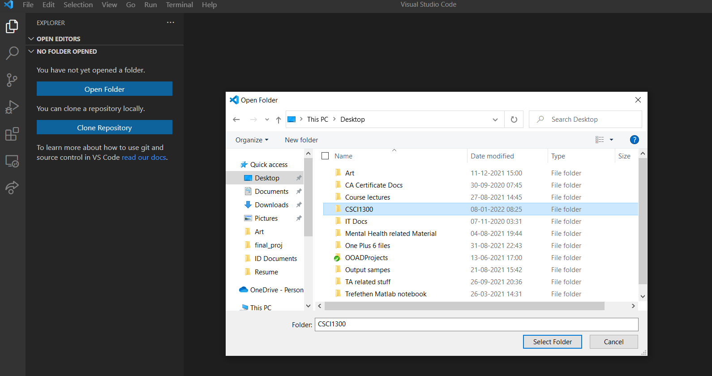

To open the Terminal tab, go to the menu bar, locate Terminal and click on it. Select "New Terminal" to open a new terminal. A terminal looks like a dark screen when you open it and will open below the screen. 

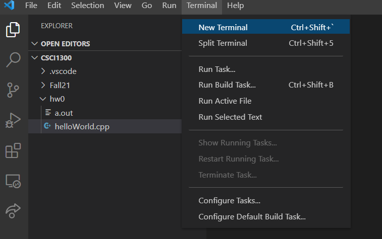
 
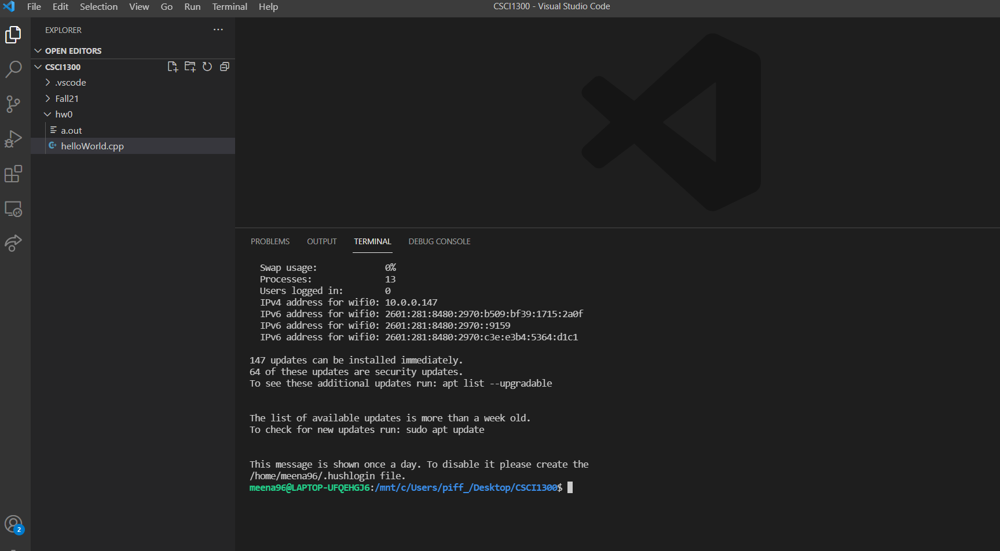

You will see your name and your device name on the terminal tab. Note that this can look different depending on your OS. 

It can look something like this:

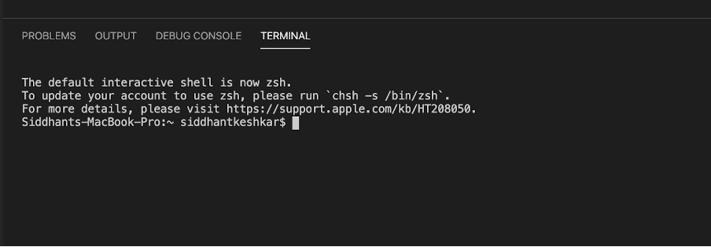

**OR** like this, depending on your operating system:

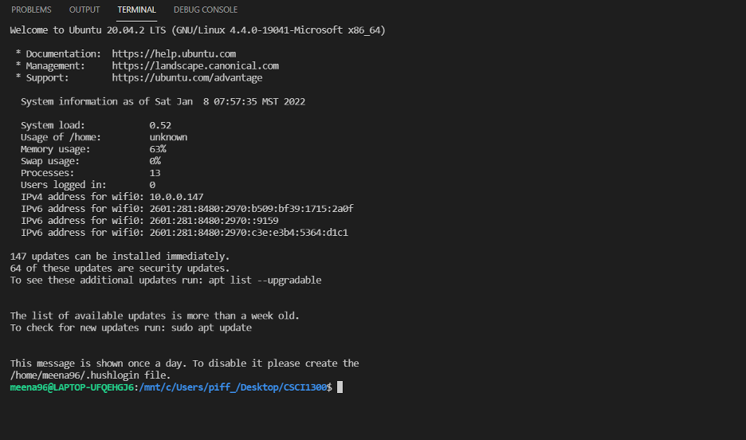

In general
1. Everything before the `:` tells you the username and the device name you’re logged in
2. Everything between the `:` and `$` is your current directory (think of a directory as the folder you’re in). Note that you do not need to be in the same directory as the screenshots shown above. Yours will depend on your computer.
 a. In the first screenshot for Mac/Linux OS it is represented as `~....$`.  `~` is shorthand for the current user's home directory.
 b.	In the second screenshot for Windows OS, it is represented as `/mnt/c/Users/...$`. 
 Note that both are equivalent, they’re just different ways of showing the path to the current directory.
3. `$` represents the end of the prompt, after which you can enter a command.

File browsing using the terminal is like using Windows explorer/Finder or clicking on folders and navigating to different folders on your machine.

In the terminal, instead of clicking on folders we use text commands to tell the computer what we want. If we want to go to a folder where we saved our last homework, we can type the commands to navigate to that folder and display its contents.

### Try these commands
```
ls -- list directory contents
```

`ls` = (that’s a lowercase “L”, not an uppercase “i”) stands for list and is used to ‘list’ or show you everything in the current directory.

Note:  after you type the command and press ENTER, a list of files and directories in your current directory is displayed as a result of the command, but then the prompt returns.

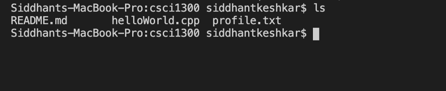


---


```
mkdir -- make directories
```

To create a new directory, use the command `mkdir <my_folder>`
Note: Spaces are troublesome on the command line, so we’ll use underscores.  

Let’s create a directory named hw0

`$ mkdir hw0`

`hw0` is now a directory/folder, nested under the csci1300 directory. If you want to list the contents of the folder, you will now notice a new item: `hw0/`, where the forward-slash (/) indicates hw0 is a subdirectory.

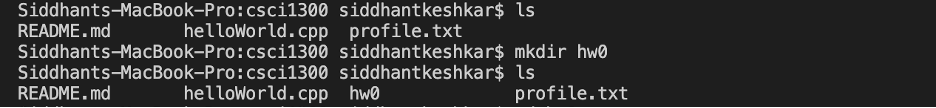

You will also notice a new folder in the explorer tab, to the left of your window:


---


```
cd -- change the shell working directory
```

`cd` = stands for change directory is just like changing folders. It means, take me to place X. Commonly used as `cd <name_of_directory>`. 
* Note that there will always be a space between cd and the name of the directory that you want to navigate to and the name of the directory will not include the carrots (side arrows) displayed above.
* Note: cd takes you places in reference to your current location. It’s like going into a folder, and then clicking on a folder within that folder, and then clicking on another folder within that folder. You will always navigate deeper within that folder. To back up, we use `cd ..` (explained in a little bit).
* Note: cd (and other commands) is case sensitive. `hw0` does not equal `Hw0`. Make sure you type in directory names exactly as they are spelled.
The command `cd ..` means go to the parent of my current location. It’s essentially backing up.


## 3. Create a Hello World program <a name="firstprogram"></a>
The "Hello, World!" program is one of the simplest programs in a programming language, and it is often used to illustrate the basic syntax of a programming language. We will need to first create a folder to store our program file in and then create the file to write the program. 

1. After you open VSCode as shown in Section 2.2, you will see the directory opened as shown.
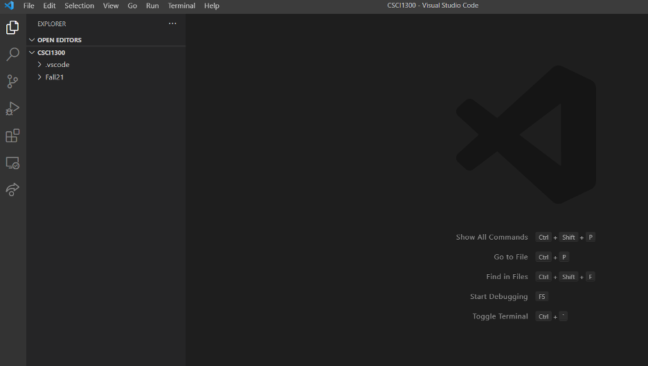

2. We now need to create a new folder within the folder we just opened, called `hmwk0`. On the left hand side of the screen, there will be a folder icon as shown below. Click on that.


3. An entry opens up. Type `hwmk0` as shown.

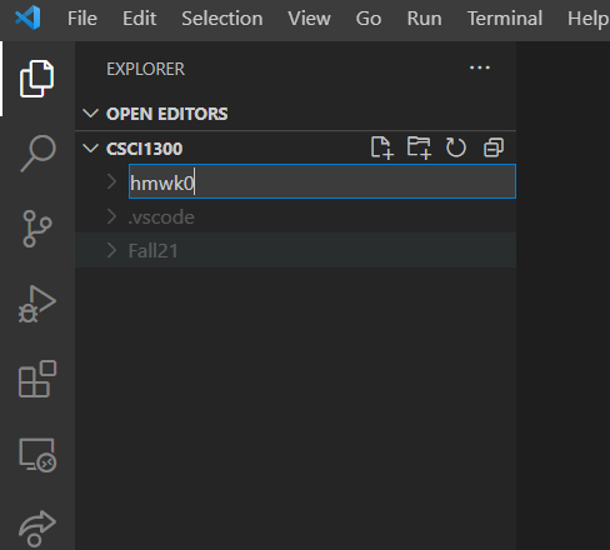

4. We now need to create our program file. From the menu bar, choose File -> New File

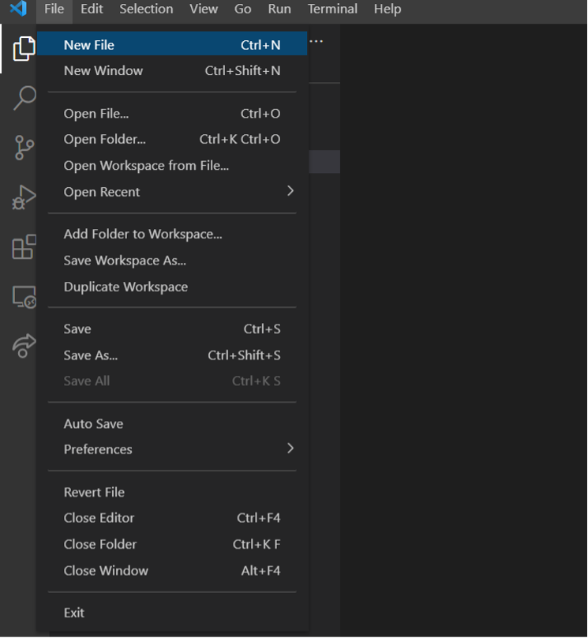

5. Save your file. Important: The filename should be named with lower *camelCase* (the first letter of the word in a compound word is lowercase and the first letter of subsequent words are capitalized) and end with .cpp. 
Your file name should be `helloWorld.cpp`.

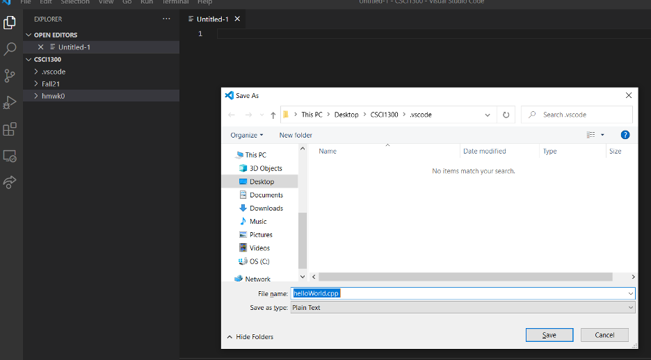

6. Type the following code into your file.
```cpp
#include <iostream>

int main() {
    std::cout << "Hello, world!" << std::endl;
}
```
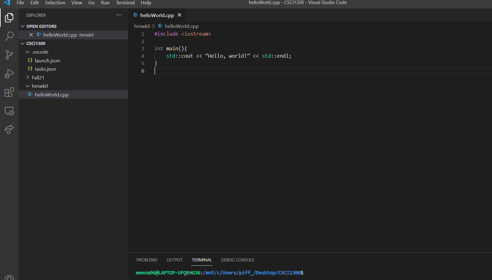
7. **Save** your file, then run your program through the terminal as mentioned below. A quick shortcut to save is **Cmd + S** (In Mac) or **Ctrl + S** (in Windows)

---

### Running a program in terminal
When you open VSCode at the bottom of the screen you should see a terminal. If not, you can open a terminal by opening the Terminal menu on the top menu bar and selecting “New Terminal”.


In order to compile and run your code you first need to navigate to where your code is saved through the terminal. When you have a folder open in VSCode by default the terminal will open to the location of that folder. If your terminal is not open, refer to the Terminal section above.

You can visualize your location using `pwd` (print working directory).

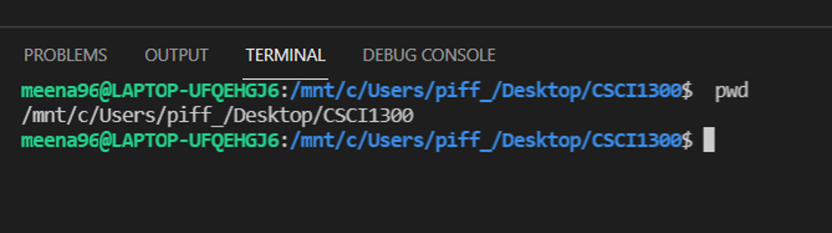

Let’s say that the code you want to run is located as follows (it can differ for your system!).

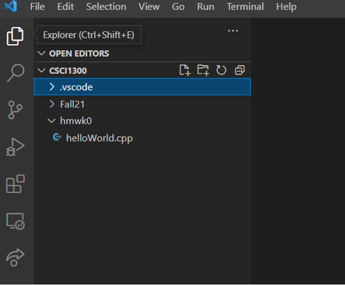

As you can see, we’re currently in the `CSCI1300` directory (on your system, it will be the directory you opened earlier). Remember, the directory name that ends before the $ on the terminal is the current directory the terminal is in. 

Our helloWorld file is under the `hmwk0` subdirectory. If it’s not, make sure it’s moved to the `hmwk0` directory. You can see the same using the `ls` command you saw before.

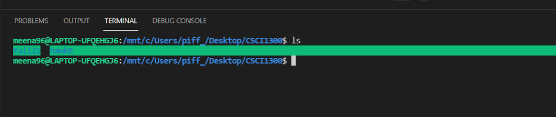

Navigate to hmwk0 using the `cd` command we saw before (i.e. run `cd hmwk0`, as in the screenshot below). We can verify we’re in the correct directory using `ls` again.

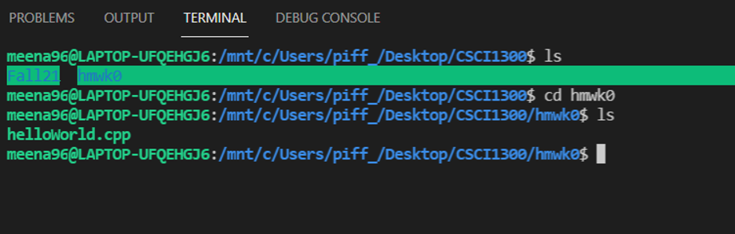

Now to compile our code we use the program g++ in the following command.
```
g++ -std=c++17 helloWorld.cpp 
```

`g++` is the compiler program

`-std=c++17` specifies the version of C++ we want to use

`helloWorld.cpp` is the file we want to compile

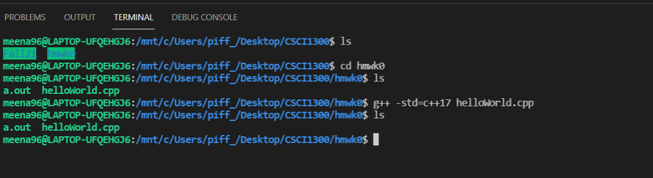

This command creates a file named `a.out` which is the compiled version of the code in `helloWorld.cpp`, which can be executed. Now to execute our code we run `a.out` by typing the following and hitting enter.

`./a.out`


If you get the output as the above, you’ve successfully run the program! And that is how you compile and run a C++ program from a terminal.

---

8. Let’s modify our program a bit. Add a statement to use the [standard namespace](https://www.tutorialspoint.com/cplusplus/cpp_namespaces.htm). Insert `using namespace std;` at the beginning of the code, then we can remove the `std::` prefixes. Run the program again using the steps above.

Note: Every time you make changes to the program, you need to follow the steps from **Running a program in terminal**. You do not need to do this after every change, you can cumulatively do this.

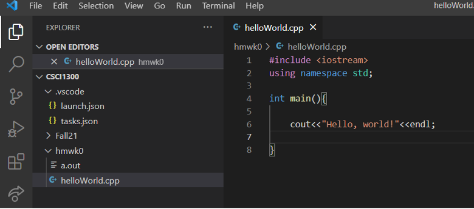

9. Let’s modify the file to print “Hello world! Hello CSCi 1300”. The text inside of the quotation marks is printed as it is. It’s case sensitive too! To see the updated output, compile and run again.


Congratulations! You’ve implemented your first C++ program! 

You will learn more C++ syntax over the semester to build your programming and problem-solving skills. Here is a snapshot of your program (from the class textbook: Brief C++: Late Objects, Enhanced eText; we recommend you check it out!). 


## Advanced Terminal commands
Now that you’ve learnt the basic commands, here are some additional commands you can try out:

```
cp -- copy files
```
(**Note** Be very careful not to overwrite a file when copying.)
1. First, click inside the explorer tab, where the file `helloWorld.cpp` is open. Go up to the menu and choose File -> Save As and, when the dialog box opens, change the name of the file to `hello1300.cpp`. Choose hw0  as the destination folder.

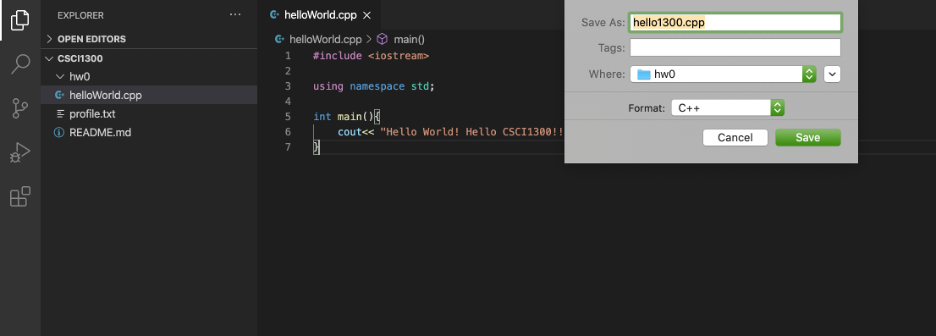

2. Once you click Save, the new file will appear in the explorer tab, to the left side of the window.

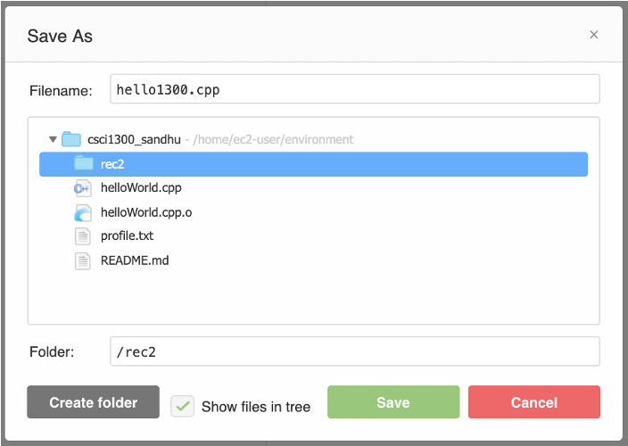

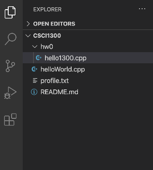

3. Let’s make another directory named hw1.
```
$ mkdir hw1
```

4. Now we want to copy the file from `hw0` into `hw1`. First, we go into the hw0 directory:
```
$ cd hw0
```

5. Ok, now we use the command for copying files:
```
$ cp hello1300.cpp hello1300v2.cpp
```

6. Now let’s type `ls` and see what we have:
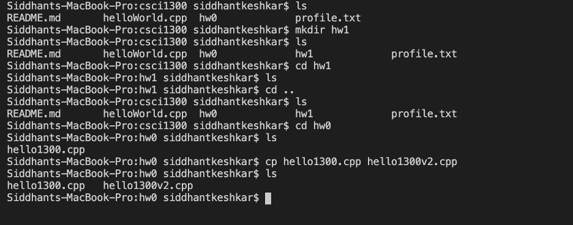

Since we did not specify the path for the file we wanted to copy, nor for where we want it copied, we now have an identical copy of the file, both of them inside the folder `hw0`.

7. Let’s do this again, including the path:
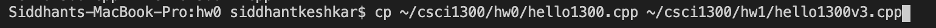
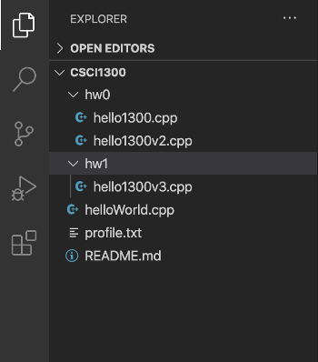

8. If your terminal window is full, you can always `clear` it. You can type the command “clear” OR right-click anywhere within the terminal, and choose “Clear”. 
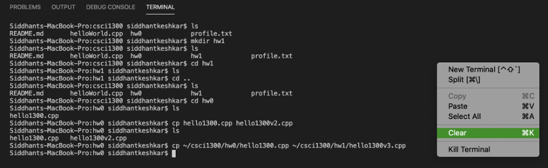


---


```
mv -- move files
```
It’s possible to move files around using the command `mv`.  Starting in directory `hw0`, type:
```
$ mv hello1300.cpp ..
```

Remember, two dots indicate the parent directory (one level up).  Now if we list the files in `hw0`, there is only `hello1300v2.cpp` left. And we have moved the file `hello1300.cpp` up in the root directory:


Let’s move one more file into the hw1 directory:

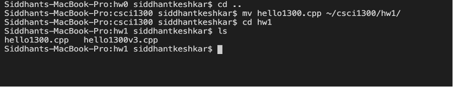


---


```
zip (unzip) - package and compress (archive) files
```

An important thing to know for this class is how to `zip` your solution files into one assignment submission file.  To do this, there’s a convenient command called `zip`.  Let’s `zip` up the two files in the directory hw1 into a single zip file named `testFiles.zip`.

```
$ zip test_files.zip hello1300.cpp hello1300v3.cpp
```

The first argument is the name of the zip file we want to produce. The files listed next are the files that go into this zip file.  If you list your directory now, you should see three files.  Notice that the original files are still present--`zip` and `unzip` don’t destroy any files.

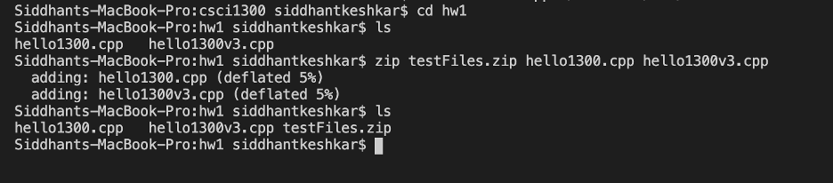

Let’s now move the .zip file from `hw1` into the `hw0` directory, and try to unzip the files:

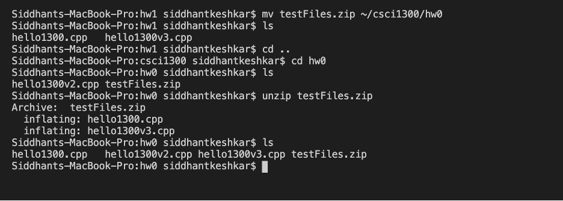

You should see the three files in the directory.  Note that the original zip file didn’t get destroyed.

**NOTE**: This command may not be available on `coding.csel.io`. If this command is unavailable on your local machine then you can install it by using the terminal command:
```
sudo apt install zip
```
You will need to provide your password. Password characters are not displayed on the terminal. 

---

### Linux commands we've learned
Here are the six useful Linux commands we just practiced:
* `ls`: List directory contents. Use this command to see the list of files and folders in the current directory. 
* `mkdir`: Make directories. Create a new directory (folder). 
* `cd`: Change directory. Use this command to change the current directory (move to another folder) 
* `cp`: Copy a file 
* `mv`: Move a file 
* `zip`: Create a zip file 

### Fun tips and tricks
* Tab Complete: if you're typing something in the command line that’s very long, but unique, you can hit tab when you're partially through and it will try to fill in the rest (kind of like autocomplete). If it doesn't, and you press tab twice, it tells you everything it has as options.
* Command history browsing: if you have typed a command (e.g. `gedit myFile.txt`) and want to repeat it, just press the up arrow. It will bring up your last executed command. Pressing up again will go to the one before. Pressing down will go forward in time through the list. 
* ASCII is a character encoding standard. It includes numerical characters: 0-9, letters A-Z and a-z, punctuation, and blank spaces. These character codes represent text in computers. For example, the ASCII representation of ‘D’ is 01000100, and the ASCII representation of ‘d’ is 01100100. Notice the difference? ‘D’ is different from ‘d’, therefore, it is important for you to always make sure that you have proper capitalization and spelling when you are typing from the command line. To learn more about it, check out https://www.educative.io/edpresso/what-is-ascii

**Want to learn more about Linux commands?**
http://community.linuxmint.com/tutorial/view/244 has a list of categorized Linux commands. 
Codecademy also has a course covering the command line (https://www.codecademy.com/learn/learn-the-command-line). 

## Back up often
It’s a good idea to create a backup of your workspace. Backing up a file only takes a few seconds. You will hate yourself if you lose hours of work before the deadline. We recommend that you backup your work once every thirty minutes. 

### Your computer 
It’s important to backup your computer in case your computer gets broken or your dog bites your laptop. You can use: 
* Dropbox 
* Google Drive 
* Github (be sure to use a Private repository. You can get free private repository via GitHub Student Developer Pack) 

Simply upload your entire workspace (ie, the folder all of your .cpp files are in) to your online file storage provider of choice.

# Submission Instructions <a name="submit"></a>

### Screenshot
We would like to make sure that you set up VSCode on your machine. Take a screenshot of the window for VSCode, and name it `VSCode.png` (or `VSCode.jpg`).


### Zip your submission file
Create a new directory called, `hmwk0`. In the directory, put `helloWorld.cpp` and `VSCode.png`. Then, create a zip file with them and name it `hmwk0_yourLastName.zip`. If your last name is Bezos, then the name of the zip file should be `hmwk0_Bezos.zip`. (Again, your file path does not need to be the exact same as what is shown in the screenshot, as long as your zip file contains `helloWorld.cpp`, and `VSCode.png`.)


### Submit to Canvas
Once you download the zip file, go to Homework 0 on Canvas, click “add submission”. Use the “choose file” option to upload your zip file and click “submit assignment”. You can add comments as well, if you need to convey something with respect to the current HW.


---
   

# Grading Rubric <a name="grading"></a>
| **Criteria**                                                | **Pts** |
| ----------------------------------------------------------- | ------- |
| Zip file submission with .cpp and .png files inside         | 10      |
| Recitation attendance (the week of August 22nd)*            | -1      |
| Total                                                       | 10      |

**Note:** if your attendance is not recorded, you will lose points as mentioned in the above table. Make sure your attendance is recorded. 
